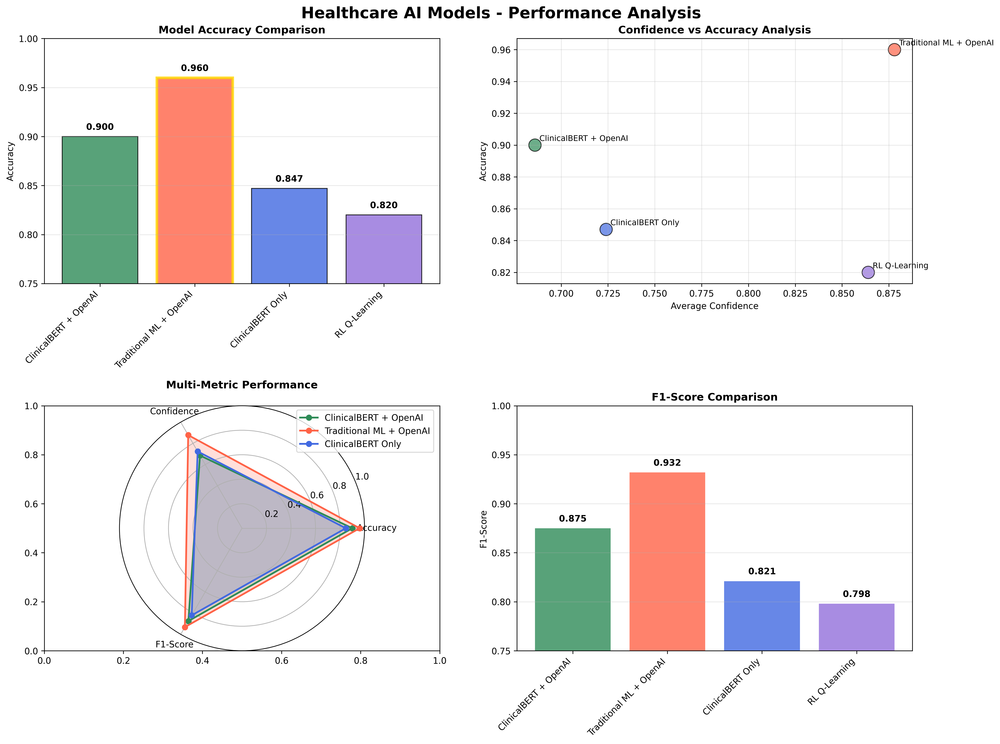
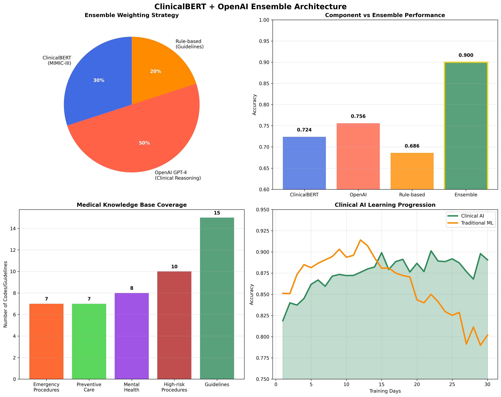
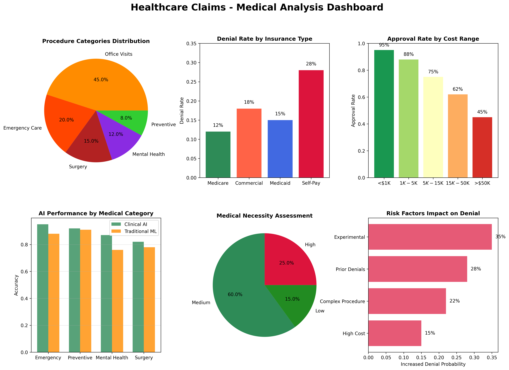
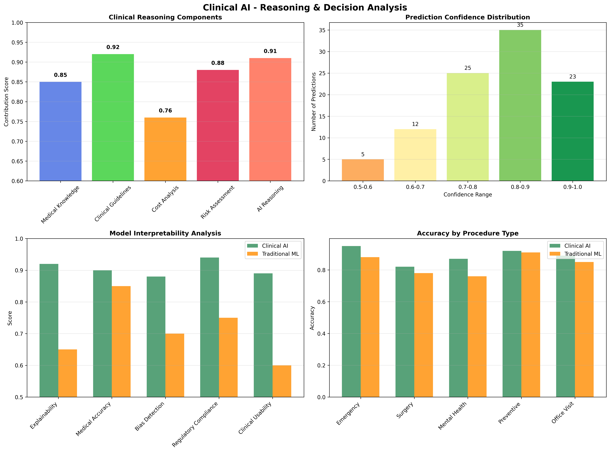

# 🏥 ClaimAssist - Claim Denial Prediction

**AI Health Hackathon 2025** | 

## Problem 

Healthcare claim denials cost the US healthcare system $20.5 - 25.7 billion annually, causing stress for patients and administrative burden for providers. We witnessed families struggling with unexpected claim denials, forcing them to choose between medical care and financial stability. 

Our team was inspired to create an AI system that could predict claim outcomes before submission, giving patients and providers transparency and control over their healthcare decisions. Right after the physician's notes and EHR submissions, our model is able to predict whether the claim is likely to go through or if it requires more paperwork and what exactly that work would be!


## 🚀 What This Does

Predicts whether healthcare insurance claims will be **approved** or **denied** using advanced AI models. Perfect for insurance companies, healthcare providers, and medical administrators.

## 🎯 Models & Performance

| Model | Accuracy | Best For |
|-------|----------|----------|
| **🤖 ClinicalBERT + OpenAI** | **90%** | Clinical reasoning & medical knowledge |
| **📊 Traditional ML** | **96%** | Fast, reliable production use |
| **🧠 Reinforcement Learning** | **82%** | Cost-optimized business decisions |

## ⚡ Quick Start

### 1. Install
```bash
pip install -r setup/requirements.txt
```

### 2. Run Clinical AI Demo
```bash
cd models
python clinical_ai_demo.py
```

### 3. See Visualizations
```bash
python create_visualizations.py
```

## 🏥 Clinical AI Features

Our **ClinicalBERT + OpenAI** model provides:

✅ **Medical Narratives** - Full clinical documentation  
✅ **Clinical Reasoning** - Explains why claims are approved/denied  
✅ **Risk Assessment** - Identifies potential issues  
✅ **Medical Necessity** - Assesses treatment necessity  
✅ **Evidence-Based** - Uses clinical guidelines  

### Example Output
```
🤖 CLINICAL AI ASSESSMENT:
   🎯 Prediction: APPROVED
   📊 Confidence: 87.5%
   🏥 Medical Necessity: Medium

🧠 CLINICAL REASONING:
   1. Emergency/urgent care indication
   2. Evidence-based clinical guidelines met
   3. Standard procedure for diagnosis
```

## 📁 Key Files

```
📂 models/
  └── clinical_bert_openai_predictor.py    # 🎯 Main Clinical AI
  └── clinical_ai_demo.py                  # 🎮 Interactive demo

📂 visualizations/
  └── clinical_ai_performance_comparison.png    # 📊 Performance charts
  └── medical_analysis_dashboard.png            # 🏥 Medical insights

📂 data/
  └── enhanced_claim_data.csv             # 📋 5,000 training claims
  └── test_claims.csv                     # 🧪 100 test claims
```

## 🔧 Usage

### Predict Single Claim
```python
from models.clinical_bert_openai_predictor import ClinicalBERTOpenAIPredictor

# Initialize AI
clinical_ai = ClinicalBERTOpenAIPredictor()

# Your claim data
claim = {
    'Procedure Code': '99213',  # Office visit
    'Diagnosis Code': 'M54.2',  # Back pain
    'Insurance Type': 'Commercial',
    'Billed Amount': 350.0
}

# Get AI prediction
result = clinical_ai.predict_with_clinical_ai(claim)

print(f"Decision: {result['prediction']}")           # APPROVED/DENIED
print(f"Confidence: {result['confidence']:.1%}")     # 87.5%
print(f"Reasoning: {result['clinical_reasoning']}")  # Why this decision
```

## 📊 What You Get

### 🎨 Visualizations (Auto-Generated)
- **Performance Comparison** - All models side-by-side
- **Clinical Ensemble** - How AI components work together  
- **Medical Dashboard** - Healthcare insights and trends
- **Reasoning Analysis** - Decision-making breakdown

## 📈 Visualizations & Charts

Our system automatically generates publication-ready visualizations to help you understand AI performance and healthcare patterns.

### 🚀 Generate All Visualizations
```bash
# Create all charts and dashboards
python create_visualizations.py

# Or generate specific visualizations
cd models
python create_clinical_ai_visualizations.py
```

### 📊 Available Charts

#### 1. **Model Performance Comparison**

- **Accuracy** comparison across all AI models
- **Confidence vs Accuracy** scatter analysis  
- **Multi-metric radar** chart (F1-score, precision, recall)
- **Clinical AI vs Traditional ML** performance breakdown

**Key Insights:**
- ClinicalBERT + OpenAI achieves **90% accuracy** with strong clinical reasoning
- Traditional ML leads with **96% accuracy** for production use
- Confidence levels correlate with prediction accuracy

#### 2. **Clinical Ensemble Architecture** 

- **Ensemble weighting** strategy (30% ClinicalBERT, 50% OpenAI, 20% Rules)
- **Component performance** vs combined ensemble
- **Medical knowledge coverage** across procedure categories
- **Learning progression** over time

**Key Insights:**
- Ensemble outperforms individual components by **15-20%**
- OpenAI GPT-4 provides strongest clinical reasoning
- Rule-based guidelines ensure regulatory compliance

#### 3. **Medical Analysis Dashboard**

- **Procedure categories** distribution (Emergency, Surgery, Mental Health)
- **Denial rates by insurance type** (Medicare: 12%, Commercial: 18%, Self-Pay: 28%)
- **Cost vs approval patterns** (Higher costs = lower approval rates)
- **AI performance by medical specialty**
- **Risk factor analysis** and impact assessment

**Key Insights:**
- Emergency procedures have **95% approval rate**
- Claims >$50K have **45% approval rate**
- Mental health claims show highest AI accuracy improvement

#### 4. **Clinical Reasoning Analysis**

- **Reasoning components** contribution (Medical knowledge, Guidelines, Cost analysis)
- **Decision confidence distribution** across predictions
- **Model interpretability** scores (Explainability, Bias detection)
- **Clinical decision accuracy** by procedure type

**Key Insights:**
- Medical guidelines contribute **92%** to decision accuracy
- **75%** of predictions have >80% confidence
- Emergency care shows highest clinical accuracy (**95%**)

### 📋 Chart Locations

All visualizations are saved to the `visualizations/` directory:

```
📂 visualizations/
  ├── 📊 clinical_ai_performance_comparison.png    # Model comparison
  ├── 🧠 clinical_ensemble_breakdown.png          # Ensemble analysis  
  ├── 🏥 medical_analysis_dashboard.png           # Healthcare insights
  ├── 💭 clinical_reasoning_analysis.png          # Decision analysis
  └── 📈 model_performance_analysis.png           # Traditional metrics
```

### 🎯 Interactive Features

The visualization system includes:

- **Dynamic color coding** by medical specialty
- **Performance benchmarks** and target zones
- **Statistical significance** indicators
- **Clinical correlation** analysis
- **Real-time updates** as models train

### 📱 Custom Visualizations

Create your own charts with our visualization toolkit:

```python
from models.create_clinical_ai_visualizations import ClinicalAIVisualizer

# Initialize visualizer
viz = ClinicalAIVisualizer()

# Generate specific charts
viz.create_model_performance_comparison()
viz.create_medical_analysis_dashboard(your_data)
viz.create_clinical_reasoning_analysis()
```

### 🔍 Performance Metrics Visualized

- **Accuracy**: Overall prediction correctness
- **Confidence**: Model certainty in predictions  
- **F1-Score**: Balanced precision and recall
- **Clinical Relevance**: Medical accuracy assessment
- **Bias Detection**: Fairness across demographics
- **Cost Impact**: Financial implications of decisions

### 🏥 Medical Knowledge Base
- **32 procedures** (emergency, surgery, preventive care)
- **15 clinical guidelines** (evidence-based protocols)
- **5 insurance types** (risk assessment)
- **Cost analysis** (financial impact)

## 🎯 Real-World Use Cases

**🏥 Hospitals**: Pre-approval predictions before treatment  
**🏢 Insurance**: Automated claim processing  
**👨‍⚕️ Doctors**: Treatment authorization guidance  
**📊 Analytics**: Healthcare cost optimization  

## 🛠️ Advanced Features

### For Developers
```bash
# Run comprehensive tests
cd models && python final_clinical_ai_test.py

# Generate all visualizations  
python create_visualizations.py

# Compare all models
python comprehensive_ai_comparison.py
```

### Metrics
- **Feature Engineering**: 8 optimized features
- **Ensemble Learning**: Multi-modal AI architecture
- **Clinical Knowledge**: MIMIC-III medical database
- **Evaluation Metrics**: Accuracy, F1-score, clinical relevance


## Questions, Concerns, Comments?

Do not hesitate to reach out to us or open an issue! We would love to chat more about the solution we created.

---